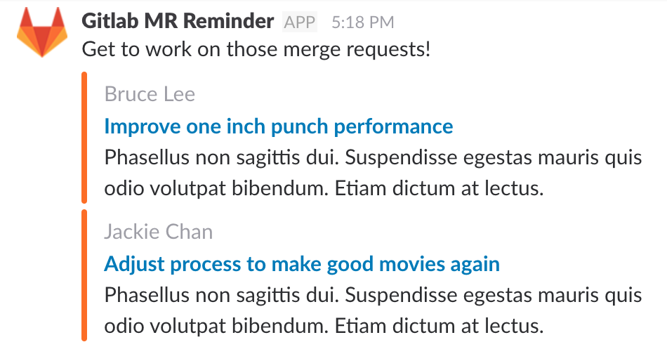

<div align="center">

# slack-gitlab-mr-reminder
by [Monokh](https://monokh.com)

[](https://badge.fury.io/js/slack-gitlab-mr-reminder) 
[](https://travis-ci.org/monokh/slack-gitlab-mr-reminder)

This node module can be used to send slack reminders for overdue gitlab merge requests. The criteria for this is currently merge requests not updated for longer than 1 day.



</div>


## Installation
`
npm install slack-gitlab-mr-reminder
`

## Example - running as an application
Install the module globally

`
npm install -g slack-gitlab-mr-reminder
`

Call `slack-gitlab-mr-reminder` with a suitable `yml` config, gitlab access token and slack webhook. See [example.yml](examples/config.yml) for an example of config.

`
GITLAB_ACCESS_TOKEN='...' SLACK_WEBHOOK_URL='...' slack-gitlab-mr-reminder examples/config.yml 
`

This will only run once and send a reminder. You will likely want to run this everyday for which a cron would be suitable:

`
0 9 * * * GITLAB_ACCESS_TOKEN='...' SLACK_WEBHOOK_URL='...' slack-gitlab-mr-reminder /absolute/path/to/config.yml 
`

This will send out reminders every day at 9AM

## Example - module
You may use the functionality as a module:

```
var SlackGitlabMRReminder = require('slack-gitlab-mr-reminder');

const reminder = new SlackGitlabMRReminder({
  slack: {
    webhook_url: 'https://hooks.slack.com/services/...',
    channel: 'merge-requests',
  },
  gitlab: {
    access_token: '...',
    group: 'mygroup'
  }
});

reminder.remind();
```

## Options

- `gitlab.group` - The name of the group to watch for merge requests - Required
- `gitlab.external_url` - The url of the gitlab installation - Defaults to https://gitlab.com (the public gitlab)

- `slack.channel` - The slack channel to post to - Required
- `slack.name` - Name of the slack poster - Defaults to `GitLab Reminder`
- `slack.message` - Message to send at the top of the slack message - Defaults to `Merge requests are overdue:`

## Change Log

### 1.2.0
- Fixed bug which was causing `gitlab.external_url` option to not work correctly
- Added binary to package
